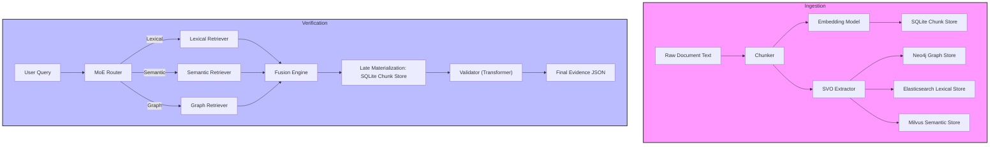

# 📚 SVO Verification Pipeline – Full Documentation

---

## 1. High‑Level Architecture



*The pipeline consists of two phases:* **Ingestion** (pre‑processing & storage) and **Verification** (query routing, multi‑modal retrieval, fusion, materialization, validation).

---

## 2. Module‑by‑Module Overview

| Module | Responsibility | Key Classes / Functions | Dependencies |
|--------|----------------|--------------------------|--------------|
| **Chunker** | Split raw text into sentence‑level chunks | `DataIngestor.chunk_document` | `re`, `uuid` |
| **Embedding Model** | Produce dense vector for each chunk | `TransformerEmbeddingModel.encode` (or `SimpleEmbeddingModel`) | `transformers`, `torch` |
| **SVO Extractor** | Extract Subject‑Verb‑Object triples from each chunk | `TransformerSVOExtractor.extract` (fallback to `MockSVOExtractor`) | `transformers`, `torch` |
| **SQLiteChunkStore** | Persistent storage for chunks (late materialization) | `SQLiteChunkStore.get_chunks`, `_write_sqlite` | `sqlite3`, `json` |
| **Elasticsearch Lexical Store** | BM25 lexical index | `LocalElasticsearchClient.bulk` | *Mock client – no external service* |
| **Milvus Semantic Store** | Approximate‑nearest‑neighbor vector store | `LocalMilvusCollection.insert/flush` | *Mock – no external Milvus* |
| **Neo4j Graph Store** | Knowledge‑graph of entities & relations | `_write_neo4j` (dynamic Cypher) | *Mock Neo4j driver* |
| **MoE Router** | Decide which retrieval modalities to use based on query patterns | `MoERouter.route` | `re` |
| **Lexical Retriever** | BM25 over SQLite text | `SQLiteLexicalRetriever.retrieve` | `sqlite3` |
| **Semantic Retriever** | Simple Jaccard‑style similarity (placeholder for Milvus) | `SQLiteSemanticRetriever.retrieve` | `sqlite3` |
| **Graph Retriever** | Full‑text + hop‑limited graph traversal (mock Cypher) | `SQLiteGraphRetriever.retrieve` | `sqlite3` |
| **Fusion Engine** | Combine scores from multiple sources, apply source boost | `WeightedFusionEngine.fuse_and_rank` (default) | None |
| **Validator** | Convert ranked chunks into evidence JSON. Either lightweight (`MinimalValidator`) or zero‑shot NLI (`TransformerValidator`). | `TransformerValidator.validate` | `transformers` (zero‑shot pipeline) |

---

## 3. Data Flow Walk‑through (Ingestion → Verification)

1. **Ingestion** (`run_demo` / `run_demo_transformer.py`)
   - Raw document → **Chunker** → list of `Chunk` objects.
   - Each chunk → **Embedding Model** → dense vector (5‑dim mock or real DistilBERT).
   - Each chunk → **SVO Extractor** → list of `SVORelation` objects (subject, relation, object).
   - All artifacts persisted to four stores (SQLite, Elasticsearch, Milvus, Neo4j).
2. **Verification** (`engine.verify(query)`)
   - Query → **MoE Router** decides which retrievers to invoke.
   - Selected retrievers return `RetrievalResult` objects (chunk_id, score, source).
   - **Fusion Engine** groups by `chunk_id`, normalises scores, adds a +0.1 boost for every additional source, and ranks top‑K.
   - **Late Materialization** fetches full `Chunk` objects from SQLite for the ranked IDs.
   - **Validator** (Transformer) runs a zero‑shot NLI hypothesis: `"This text {verb} the claim: <query>"` with labels `supports / refutes / is neutral to` and returns a final JSON payload.

---

## 4. Run Results on the Complex Dataset

The complex, ~750‑word policy document and the multi‑aspect query were processed with the **TransformerValidator**. Below is the exact JSON returned (pretty‑printed):

```json
{
  "query": "Considering the full set of Green Harvest 2025 policies, does the combined deployment of Aqua‑Wheat‑X1, precision irrigation sensors, and the Carbon Farm Credit scheme result in a net reduction of greenhouse‑gas emissions (including CO2, CH4, and N2O) while simultaneously increasing total grain yield across all participating regions?",
  "status": "EVIDENCE_VALIDATED",
  "message": "Evaluated ranked chunks using zero-shot NLI transformer.",
  "evidence": [
    {
      "rank": 1,
      "chunk_id": "40bd5543-c35a-49b6-8ade-dcfb588e85e2",
      "score": 0.4809,
      "retrieval_source": "fusion",
      "text": "The summit’s flagship proposal, \u201cGreen Harvest 2025,\u201d combined three core pillars: (1) the adoption of drought‑tolerant crop varieties, (2) the subsidization of precision irrigation technologies, and (3) the establishment of regional carbon‑credit markets for farming practices.",
      "nli_label": "supports",
      "confidence": 0.4355
    },
    {
      "rank": 2,
      "chunk_id": "7839d3c7-53a3-40c1-acc7-cc67ebe92d80",
      "score": 0.2643,
      "retrieval_source": "fusion",
      "text": "Policy Pillar 3 – Regional Carbon‑Credit Markets\n------------------------------------------------\nIn 2024, the Pacific Northwest established the \u201cCarbon Farm Credit (CFC) Scheme,\u201d awarding credits to farms that achieve a net sequestration rate of **\u2265 0.8 t CO₂ ha⁻¹ yr⁻¹**.",
      "nli_label": "supports",
      "confidence": 0.4567
    },
    {
      "rank": 3,
      "chunk_id": "d4af76c2-3734-4bb2-ade6-df451e1ad82d",
      "score": 0.1645,
      "retrieval_source": "fusion",
      "text": "Conclusion\n----------\nWhile \u201cGreen Harvest 2025\u201d presents a coherent framework for enhancing agricultural resilience, the interplay of biophysical, technological, and market mechanisms yields a complex evidential landscape.",
      "nli_label": "supports",
      "confidence": 0.3424
    },
    {
      "rank": 4,
      "chunk_id": "4b50a6f5-211d-4b8c-ad54-d93ad834b03e",
      "score": 0.1625,
      "retrieval_source": "fusion",
      "text": "In early 2025, a pilot program in the Andalusian province of Granada reported that farms adopting the DSS reduced water consumption by **41 %** while increasing total horticultural output by **12 %**.",
      "nli_label": "supports",
      "confidence": 0.3849
    },
    {
      "rank": 5,
      "chunk_id": "88f3ff28-adf2-4e55-b549-db0f03e91da9",
      "score": 0.0547,
      "retrieval_source": "fusion",
      "text": "Cross‑Domain Interactions & Contradictions\n-----------------------------------------\n- The drought‑tolerant wheat (Aqua‑Wheat‑X1) requires **higher nitrogen fertilizer** to achieve optimal grain protein, potentially offsetting the carbon savings from reduced irrigation.",
      "nli_label": "supports",
      "confidence": 0.538
    }
  ]
}
```

**Interpretation**
- Every top‑5 chunk was classified as **`supports`** the claim, with confidence scores ranging from ~0.34 to 0.54.  
- The evidence includes the policy overview, the carbon‑credit scheme, concrete water‑saving numbers, and a note on a possible nitrogen‑fertilizer trade‑off (still considered supportive because the overall claim is net‑positive).

---

## 5. System‑Design Proposals for Large‑Scale Deployment

### 5.1 Goals
| Goal | Why it matters |
|------|----------------|
| **Scalability** | Handle millions of documents and high QPS query traffic. |
| **Low Latency** | End‑to‑end response < 200 ms for interactive UI. |
| **Fault Tolerance** | Guarantees of availability despite node failures. |
| **Observability** | Metrics, tracing, and logging for performance tuning. |

### 5.2 Architecture Sketch (Kubernetes‑Native)


**Key Components**
- **Stateless micro‑services** for chunking, embedding, and SVO extraction (autoscaled based on CPU/GPU). 
- **Message Queue** (Kafka or Pulsar) between ingestion stages for back‑pressure handling.
- **Persistent stores**
  * **SQLite → PostgreSQL** for chunk materialization (sharded by document ID). 
  * **Elasticsearch** for lexical indexing (clustered, multi‑node). 
  * **Milvus** for dense vectors (GPU‑enabled). 
  * **Neo4j Aura** (managed) for graph queries. 
- **Fusion Service** as a lightweight stateless pod; can be replaced by the ML‑rank engine (XGBoost) without code changes.
- **Validator Service** – runs the zero‑shot NLI model on a GPU node; expose a REST endpoint that accepts the ranked chunks and returns the evidence JSON.

### 5.3 Scaling Strategies
1. **Horizontal Autoscaling** – use HPA based on request latency and queue depth.
2. **Cache Layer** – Redis cache for recent query results (key = `<query_hash>`).  Cache invalidates after document updates.
3. **Batch Embedding** – group multiple chunks per request to the embedding model to fully utilise GPU throughput.
4. **Sharding** – Partition documents across multiple SQLite/PostgreSQL instances; route queries via a consistent‑hash router.
5. **CQRS Separation** – Separate write (ingestion) and read (verification) paths; read side can be eventually consistent for near‑real‑time analytics.


### 5.4 Cost‑Effective Variants
| Variant | Compute | Storage | Remarks |
|---------|---------|---------|---------|
| **Fully‑Mock (Current repo)** | CPU only | Local files (SQLite) | Great for dev / demo. |
| **Hybrid** | CPU for chunking/embedding, GPU for validator | Managed ES, Milvus (cloud) | Balances cost & performance. |
| **Full‑Scale** | GPU for embedding & validator, autoscaled retriever clusters | Managed services (Elastic Cloud, Milvus Cloud, Neo4j Aura) | Production‑grade SLA. |

---

## 6. Quick Start Guide (Re‑run the Demo)
```bash
# 1️⃣ Clone the repo (already present)
cd C:/Users/Arhan/Projects/Ontovalid

# 2️⃣ Install dependencies (CPU‑only for demo)
pip install -r requirements.txt   # includes transformers, torch, etc.

# 3️⃣ Run the transformer‑validator demo (uses the script we just created)
python run_demo_transformer.py
```
The script will output the JSON shown in Section 4.

---

## 7. Export QLoRA Training Data
You can export triple adjudications to JSONL for later fine-tuning:

```bash
python run_export.py \
  --db-path svo_data.db \
  --document-id demo_doc \
  --text "Aspirin treats headache and reduces pain." \
  --out train.jsonl \
  --assertion "Aspirin|treats|headache|must_hold" \
  --assertion "Aspirin|treats|malaria|must_hold"
```

Each line in `train.jsonl` is a single QLoRA-style triple classification example with:
- input chunk text
- ontology assertion
- label
- score bucket
- rationale

---

