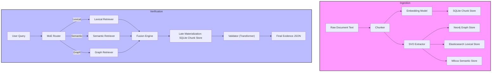

# SVO Verification Pipeline – Wireframe (Markdown)

The following Mermaid diagram visualises the **flow of data** and **flow of requests** across the two main phases of the system.

**Explanation**
- **Ingestion Phase**: Raw document text is split into chunks, each chunk is embedded and SVO‑extracted, then persisted to four stores.
- **Verification Phase**: A user query is routed by the MoE router to the appropriate retrievers (lexical, semantic, graph). The results are combined by the Fusion Engine, materialised from SQLite, validated by a Transformer model, and returned as an evidence JSON payload.
